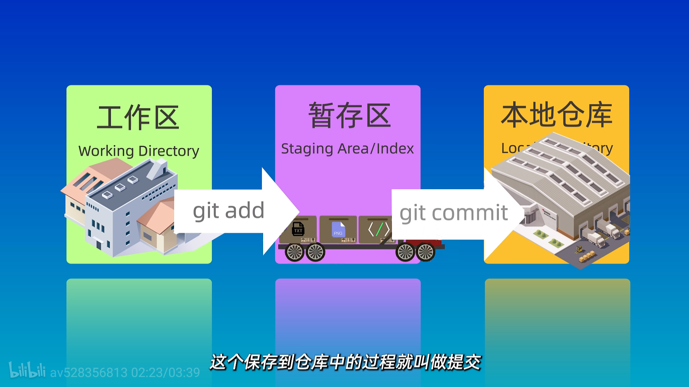
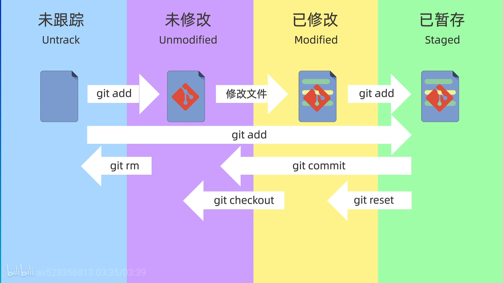

# Git

[西二在线的github&git教程](https://west2-online.feishu.cn/wiki/Lsz9w3CiGinXzgkevtmceHZknrf)

## 安装

[西二在线的git安装教程](https://west2-online.feishu.cn/wiki/Iv8owApYwinn0akMpaQciUDanCb)

```bash
git --version
```

如果安装成功，会显示git的版本号。

## 使用方式

- 命令行
- 图形界面工具（如GitHub Desktop、Sourcetree等）
- 集成开发环境（如VS Code、IntelliJ IDEA等）

## 配置

### 设置用户名和邮箱

```bash
git config --global user.name "qiwnowinan"
git config --global user.email "qiwnowinan@163.com"
```

### 查看配置

```bash
git config --global --list
```

## 创建仓库

在当前目录下创建一个新的git仓库  
注意：在执行`git init`之前，确保在一个空目录或者想要版本控制的项目目录中。

```bash
git init
```

## 克隆仓库

```bash
git clone https://github.com/ClaudyaRiano/AICode
```

## 工作区域

- 工作区（Working Directory）：你正在编辑的文件所在的目录。
- 暂存区（Staging Area）：你准备提交的文件所在的区域。
- 本地仓库（Local Repository）：你提交的文件所在的仓库。
- 远程仓库（Remote Repository）：你推送代码的远程仓库



## 文件状态

- Untracked：未跟踪的文件，Git没有将其纳入版本控制。
- Unmodified：未修改的文件，Git已经跟踪，并且内容没有发生变化。
- Modified：已修改的文件，Git已经跟踪，但内容发生了变化。
- Staged：已暂存的文件，Git已经跟踪，并且已经准备好提交。



## 添加和提交文件

```bash
git status # 查看文件状态

git add file.txt # 将文件添加到暂存区(如file.txt)

git commit -m "提交信息" # 提交暂存区的文件到本地仓库
```
