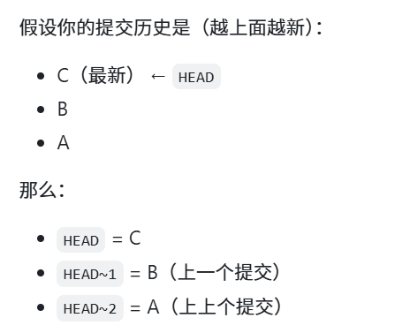
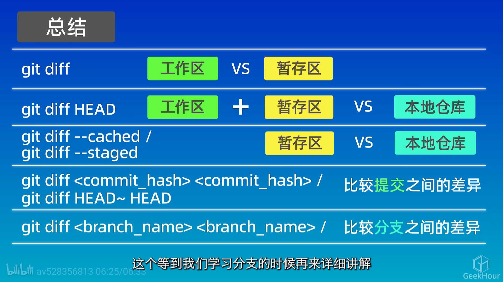

# Git

[西二在线的github&git教程](https://west2-online.feishu.cn/wiki/Lsz9w3CiGinXzgkevtmceHZknrf)

## 安装

[西二在线的git安装教程](https://west2-online.feishu.cn/wiki/Iv8owApYwinn0akMpaQciUDanCb)

```bash
git --version
```

如果安装成功，会显示git的版本号。

## 使用方式

- 命令行
- 图形界面工具（如GitHub Desktop、Sourcetree等）
- 集成开发环境（如VS Code、IntelliJ IDEA等）

## 配置

### 设置用户名和邮箱

```bash
git config --global user.name "qiwnowinan"
git config --global user.email "qiwnowinan@163.com"
```

### 查看配置

```bash
git config --global --list
```

## 创建仓库

在当前目录下创建一个新的git仓库  
注意：在执行`git init`之前，确保在一个空目录或者想要版本控制的项目目录中。

```bash
git init
```

## 克隆仓库

```bash
git clone https://github.com/ClaudyaRiano/AICode
```

## 工作区域

- 工作区（Working Directory）：你正在编辑的文件所在的目录。
- 暂存区（Staging Area）：你准备提交的文件所在的区域。
- 本地仓库（Local Repository）：你提交的文件所在的仓库。
- 远程仓库（Remote Repository）：你推送代码的远程仓库


## 文件状态

- Untracked：未跟踪的文件，Git没有将其纳入版本控制。
- Unmodified：未修改的文件，Git已经跟踪，并且内容没有发生变化。
- Modified：已修改的文件，Git已经跟踪，但内容发生了变化。
- Staged：已暂存的文件，Git已经跟踪，并且已经准备好提交。


## 添加和提交文件

```bash
git status # 查看文件状态

git add file.txt # 将文件添加到暂存区(如file.txt)
git add *.txt # 将当前目录下的所有txt文件添加到暂存区
git add . # 将当前目录下的所有文件添加到暂存区

git commit -m "提交信息" # 提交暂存区的文件到本地仓库

git log # 查看提交历史
git log --oneline # 以简洁的方式查看提交历史
```

## 回退

```bash
git reset --soft HEAD~1 # 回退到上一个提交，保留修改
git reset --hard HEAD~1 # 回退到上一个提交，丢弃修改
git reset --mixed HEAD~1 # 回退到上一个提交，保留修改但不保留暂存区的状态

git reset --soft <commit_id> # 回退到指定提交(用commit_id),commit_id可以通过git log查看
git reset --hard <commit_id> # 回退到指定提交(用commit_id)
git reset --mixed <commit_id> # 回退到指定提交(用commit_id)

git reflog # 查看所有的提交记录，包括被回退的提交
# 如果误操作了，可以通过git reflog找到被回退的提交的commit_id，然后使用git reset --hard <commit_id>恢复到那个提交
```




## 查看差异

```bash
git diff # 查看工作区和暂存区的差异
git diff HEAD # 查看所有未提交的修改和上一个提交的差异
git diff --cached # 查看暂存区和上一个提交的差异

git diff Git.md # 查看Git.md文件的差异

git diff <commit1_id> <commit2_id> # 查看两个提交之间的差异
git diff HEAD~1 HEAD # 查看上一个提交和当前提交之间的差异

git diff <branch1> <branch2> # 查看两个分支之间的差异
```



## 删除文件

```bash

git rm file.txt # 删除文件并将删除操作添加到暂存区
git rm --cached file.txt # 仅将文件从暂存区移除，但保留在工作区
```

## 忽略文件

test
