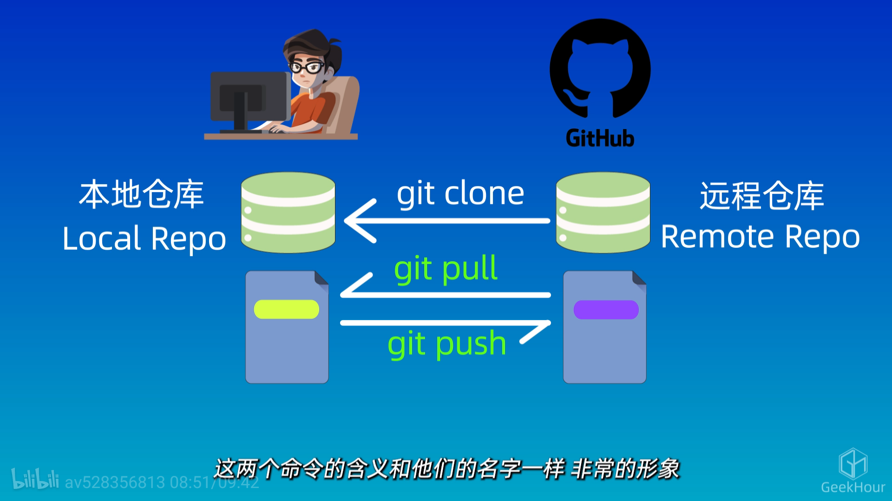
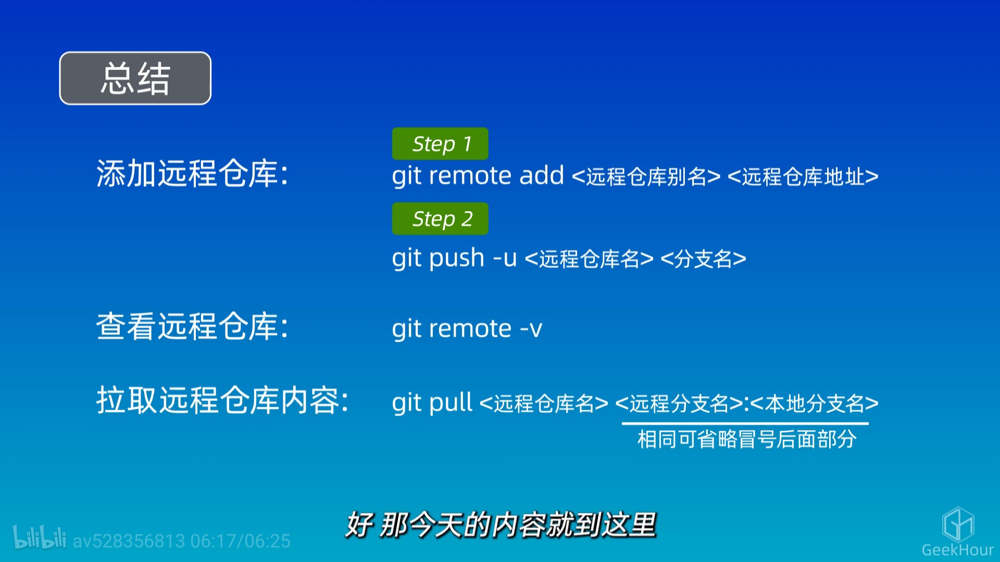
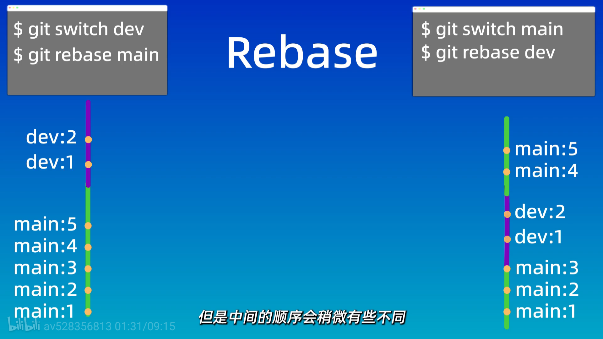

# github

## 访问

可以去Microsoft Store下载Watt Toolkit,就可以流畅访问github了

## 创建仓库

[西二在线创建仓库教程](https://west2-online.feishu.cn/wiki/GaRpw5gevi5uBMkTZO4ceQylnQd)

## 配置SSH

- 保证全局的git配置了正确的用户名和邮箱(需要作为SSH key的参数)  
- 先保证用户目录下有.ssh文件夹，如果没有就创建一个  
- 进入.ssh文件夹，使用ssh-keygen命令生成SSH key，按照提示操作即可

```bash
ssh-keygen -t ed25519 -C "qiwnowinan@163.com" -f "C:\Users\86183\.ssh\id_ed25519" -N ""
```

- 生成完成后，使用cat命令查看公钥内容

```bash
cat ~/.ssh/id_ed25519.pub 
# cat命令是用来查看文件内容的，id_ed25519.pub是公钥文件，执行这个命令会显示公钥的内容
```

- 将公钥内容复制到GitHub的SSH key设置中，保存即可
- 测试SSH连接

```bash
ssh -T git@github.com
```

如果成功，会显示欢迎信息，说明SSH配置成功了。

需要config文件(要注意文件编码格式)配置SSH key的路径，内容如下：

```bash
Host github.com
    Hostname ssh.github.com
    Port 443
    User git
    IdentityFile ~/.ssh/id_ed25519
```

## 关联本地仓库和远程仓库

```bash
git remote add origin 远程仓库的SSH/HTTPS地址
# origin是远程仓库的别名，可以自定义，常用的名字是origin

git remote remove 别名
# 删除远程仓库的关联

git remote -v
# 查看远程仓库的详细信息，包括别名和URL
```

## push和pull



配置SSH后，就可以使用SSH协议进行push和pull了，命令如下：

```bash
git branch -M main
# 将当前分支重命名为main

git push -u origin main
# 将本地仓库的main分支推送到远程仓库，并设置origin为默认的上游仓库

git push
# 以后只需要执行git push就可以将本地的main分支推送到远程仓库了(前提是已经设置了默认的上游仓库)

git pull origin main
# 从远程仓库的main分支拉取最新的代码并合并到当前分支

git pull
# 从默认的上游仓库拉取最新的代码并合并到当前分支
```



## 分支

分支是Git的一个重要概念，它允许你在同一个仓库中同时进行多个开发工作，而不会互相干扰。每个分支都是一个独立的开发线，你可以在不同的分支上进行不同的开发工作，最后再将它们合并到一起。

```bash
git branch -M main
# 将当前分支重命名为main

git branch # 查看本地分支

git branch dev # 创建一个名为dev的新分支

git switch dev # 切换到dev分支

git merge dev # 将dev分支合并到当前分支
# 如果当前分支是main，那么这个命令就是将dev分支合并到main分支
# 分支合并后，并没有消失

git branch -d dev # 删除dev分支
# 这个命令会删除dev分支，但如果dev分支上有未合并的提交，Git会提示你无法删除，除非你使用git branch -D dev强制删除
```

### 分支的合并冲突

当你在不同的分支上修改了同一个文件的同一部分内容，并且尝试将它们合并时，就会发生合并冲突。Git无法自动决定应该保留哪个版本的内容，所以需要你手动解决冲突。  

如：两个分支都修改了Git.md文件的同一行内容，当你尝试将它们合并时，就会发生冲突，Git会在文件中标记出冲突的部分，你需要手动编辑文件，选择保留哪个版本的内容，或者合并两者的内容，解决完冲突后，再进行提交。

## rebase

rebase的基本思想是将一个分支上的提交“搬移”到另一个分支上，就好像这些提交是从那个分支上直接创建的一样。

```bash
git rebase main
# 将当前分支上的提交搬移到main分支上

git rebase dev
# 将当前分支上的提交搬移到dev分支上
```



## 其他代码托管平台

如：gitee和gitlab
